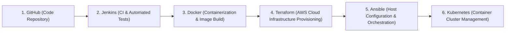

# Space Invaders AWS Infrastructure with Terraform

Welcome to the **Infrastructure as Code (IaC)** stage for the **Space Invaders Canvas Game** project!

This guide provides everything you need to understand, configure, test, and manage AWS infrastructure using Terraform in a beginner-friendly way.

---

## 1. What Terraform Does in This Project

* **Infrastructure as Code (IaC)**: Instead of manually clicking through the AWS Management Console to create VPCs, subnets, firewall rules, and virtual machines, Terraform allows us to define all AWS cloud resources in declarative configuration files (`.tf`).
* **Automated & Reproducible**: With a single command, Terraform provisions an entire secure networking and compute environment on AWS.
* **Safe Teardown**: When you are finished practicing or testing, another single command completely removes all created AWS resources to prevent unexpected cloud costs.

---

## 2. The Complete DevOps Lifecycle

Here is how Terraform connects with the preceding and upcoming stages of our project:



1. **GitHub**: Stores source code, tests, and configuration files.
2. **Jenkins CI**: Clones the code, runs 32 automated unit tests, validates syntax, and builds Docker images.
3. **Docker**: Packages the game + Nginx web server into a portable container image (`space-invaders:1.0`).
4. **Terraform (Current Stage)**: Automatically provisions an AWS VPC, Public Subnet, Internet Gateway, Security Group, and EC2 Instance.
5. **Ansible (Upcoming)**: Connects to the provisioned EC2 instance to configure dependencies, install runtimes, and deploy our Docker container.
6. **Kubernetes (Upcoming)**: Scales and manages resilient multi-container game deployments.

---

## 3. How to Check / Install Terraform on Windows

### Check if Terraform is installed
Open your PowerShell or Command Prompt and run:
```powershell
terraform -version
```

### If Terraform is NOT installed:
You can install Terraform using any of these easy methods:

* **Option A: Using Windows Package Manager (`winget`)** (Recommended)
  ```powershell
  winget install HashiCorp.Terraform
  ```

* **Option B: Using Chocolatey**
  ```powershell
  choco install terraform
  ```

* **Option C: Manual Binary Download**
  1. Visit the official HashiCorp website: [https://developer.hashicorp.com/terraform/install](https://developer.hashicorp.com/terraform/install)
  2. Download the Windows AMD64 `.zip` archive.
  3. Extract `terraform.exe` into a folder (e.g. `C:\tools\terraform\`).
  4. Add that folder path to your Windows System `PATH` environment variable.
  5. Restart your terminal and verify with `terraform -version`.

---

## 4. Secure AWS Credentials Configuration

> [!CAUTION]
> **NEVER** write your AWS Access Key or Secret Key inside `.tf` files, commit them to GitHub, or share them.

Configure your AWS credentials on your machine using one of these secure methods:

### Method 1: AWS CLI `aws configure` (Recommended)
If you have AWS CLI installed, run:
```bash
aws configure
```
Enter your details when prompted:
* `AWS Access Key ID`: `[Your Access Key]`
* `AWS Secret Access Key`: `[Your Secret Key]`
* `Default region name`: `us-east-1` (or your preferred region)
* `Default output format`: `json`

This securely stores credentials in `~/.aws/credentials` on your machine, where Terraform automatically detects them.

### Method 2: Temporary Environment Variables in PowerShell
```powershell
$env:AWS_ACCESS_KEY_ID="your_access_key_here"
$env:AWS_SECRET_ACCESS_KEY="your_secret_key_here"
$env:AWS_REGION="us-east-1"
```

---

## 5. Setting Up `terraform.tfvars`

1. Navigate to the `terraform/` directory:
   ```bash
   cd terraform
   ```
2. Copy the example configuration template:
   ```bash
   cp terraform.tfvars.example terraform.tfvars
   ```
3. Open `terraform.tfvars` and customize any parameters:
   * `aws_region`: AWS region (default: `"us-east-1"`)
   * `instance_type`: EC2 instance size (default: `"t2.micro"`)
   * `key_name`: Name of your existing EC2 SSH key pair (optional)
   * `ssh_allowed_cidr`: Permitted IP range for SSH access (default: `["0.0.0.0/0"]`)

---

## 6. How to Create / Select an EC2 Key Pair (Optional for SSH)

If you plan to SSH into your EC2 instance:
1. Log in to the [AWS Management Console](https://console.aws.amazon.com/).
2. Navigate to **EC2** → **Network & Security** → **Key Pairs**.
3. Click **Create key pair**:
   * Name: `space-invaders-key`
   * Key pair type: `RSA`
   * Private key format: `.pem` (for OpenSSH) or `.ppk` (for PuTTY).
4. Save the downloaded private key file in a secure location on your machine.
5. In `terraform.tfvars`, set:
   ```hcl
   key_name = "space-invaders-key"
   ```

---

## 7. How to Find Amazon Linux AMI ID (Optional)

By default, our Terraform configuration **automatically queries and selects the latest official Amazon Linux 2023 AMI** via a data source, so you do **not** need to manually search for an AMI ID!

If you wish to specify a custom AMI:
1. Go to **EC2 Console** → **AMIs** or click **Launch Instance**.
2. Under "Application and OS Images", locate **Amazon Linux 2023 AMI**.
3. Copy the AMI ID (format: `ami-0c101f26f147fa7fd`).
4. Set it in `terraform.tfvars`:
   ```hcl
   ami_id = "ami-0c101f26f147fa7fd"
   ```

---

## 8. Terraform Command Reference & Workflow

Run these commands from inside the `terraform/` folder:

```bash
# 1. Format code according to HashiCorp standard style
terraform fmt

# 2. Initialize provider plugins and backend modules
terraform init

# 3. Validate syntax and configuration integrity
terraform validate

# 4. Preview the exact infrastructure changes that will be made
terraform plan

# 5. Provision the real infrastructure on AWS (prompts for confirmation)
terraform apply

# 6. View generated output values (IP address, DNS, VPC ID)
terraform output

# 7. Destroy all provisioned infrastructure when finished
terraform destroy
```

---

## 9. Provisioned Architecture Overview

When `terraform apply` is executed, the following resources are created:

* **VPC**: `10.0.0.0/16` custom network with DNS hostnames enabled.
* **Public Subnet**: `10.0.1.0/24` with public IP auto-assignment.
* **Internet Gateway**: Attached to VPC for direct internet connectivity.
* **Route Table**: Default route `0.0.0.0/0` targeting the Internet Gateway.
* **Security Group**:
  * Inbound Port 22 (SSH) - Restricted to `var.ssh_allowed_cidr`
  * Inbound Port 80 (HTTP) - Open for web traffic
  * Inbound Port 8080 (App) - Open for game access
  * Outbound All - Open for updates and package downloads
* **EC2 Instance**: Low-cost `t2.micro` (Free Tier eligible) running Amazon Linux 2023 with Docker pre-bootstrapped.

---

## 10. Clean Teardown to Avoid Cloud Costs

When you are done testing:
```bash
terraform destroy
```
Type `yes` when prompted. Terraform will cleanly terminate the EC2 instance, delete the security group, release network interfaces, and tear down the VPC.
